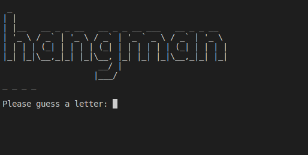
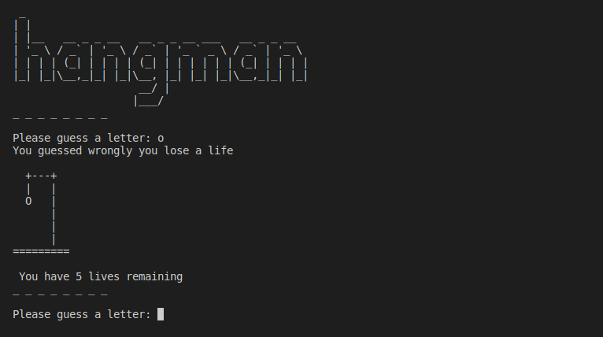
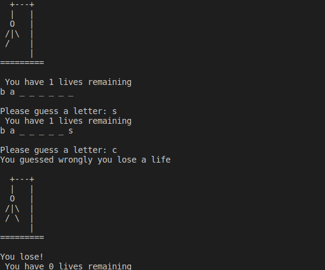

# Day7

## Lessons learned today

- New way of importing
```
from art import logo,stages
```
- while loops
```
num = 6
while num > 0:
    print("HI")
    num -= 1
```

- Recap on things learnt like for loops and if statements 

## Project to solidify material learned: 

### Hangman

> This is a game where the user is presented with a list of dashes and the player has to guess the letter that make up the dashed word

#### Preview:









## How to run this on your device

- Clone this repository
```
git clone https://github.com/kingdreamerr/Day7_Hangman.git
```
- cd into the repo
```
cd Day7_Hangman
```

- Paste the following in the terminal 
```
python3 main.py
```